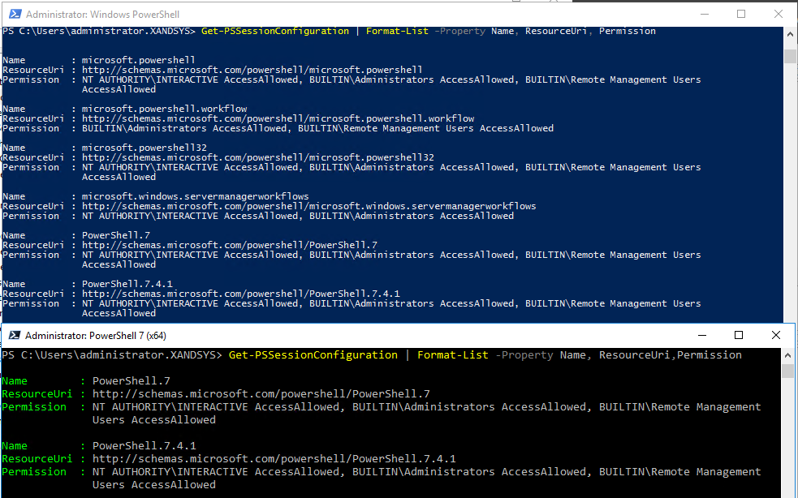

# Executing Commands using Multiple Remote Sessions

```powershell

# Define list of remote computers
$computers = "10.0.0.10","10.0.0.11","10.0.0.12"

# Create Multiple Remote Sessions
New-PSSession -ComputerName $computers

# Create Multiple Remote Sessions into Variables
$srv1, $srv2, $srv3 = New-PSSession -ComputerName $computers

```

## Session Configuration Notes

- You cannot run `Invoke-Command` against localhost or local computer name unless running your PowerShell session is Run As Administrator
  - Even if you provide Admin credentials either directly or via a Session
  - Essentially get access denied
- Be careful which [session configuration](https://learn.microsoft.com/en-us/powershell/module/microsoft.powershell.core/about/about_session_configurations?view=powershell-7.4) you are connecting to on the remote machine.
  - By default Microsoft.PowerShell (PS v5) session configuration is used for sessions by default when no ConfigurationName parameter is specified
  - PS7 does not automatically connect to PS7 endpoint unless you have updated your [$PSSessionConfigurationName](https://learn.microsoft.com/en-us/powershell/module/microsoft.powershell.core/about/about_preference_variables?view=powershell-7.4#pssessionconfigurationname) variable on your local machine
    - This is important when trying to run remote commands like Get-CimInstance, it will fail otherwise
  - If you change the $PSSessionConfiguration value make sure the namespace exists on the remote machine or the session will fail to be established
- To use a configuration name your account must be a member of the Admin group on the remote machine

```powershell

# Run the following command to see what endpoints are available and their ResourceUrl
# This is used when updating $PSSessionConfigurationName
Get-PSSessionConfiguration | Format-List -Property Name, ResourceUri, Permission

```



## WSManCredSSP

[Enable-WSManCredSSP](https://learn.microsoft.com/en-us/powershell/module/microsoft.wsman.management/enable-wsmancredssp?view=powershell-7.4) enables local credentials to be passed to a remote machine and used for further authentication and authorization.

Two parts, Client or Server role

```powershell
# Command needs to be run in an elevated admin session
# Enable CredSSP Client - Machine issuing commands
Enable-WSManCredSSP -Role Client -DelegateComputer < computername | ip | * >

# Enable CredSSP Server - Machine executing commands
# Run on each machine

Enable-WSManCredSSP -Role Server

# To execute command you need to add the Authentication Parameter and provide credential
Invoke-Command -ComputerName FileServer02 -FilePath E:\script\sample-remoting-script.ps1 -Authentication Credssp -Credential $cred

# Credssp Authentication can also set on New-PSSession
$f02 = New-PSSession -ComputerName FileServer02 -Credential $cred -ConfigurationName PowerShell.7 -Authentication Credssp

```
