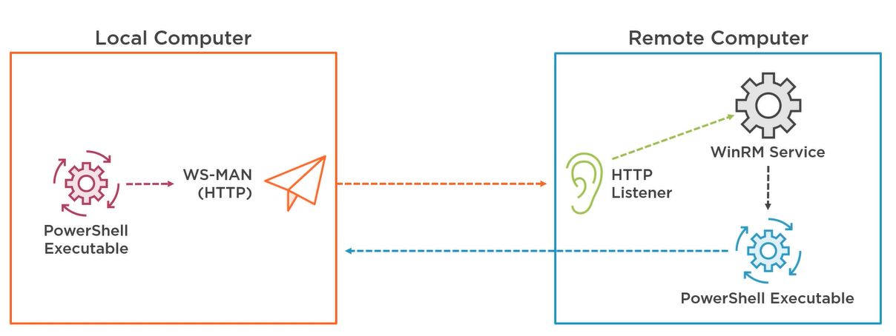
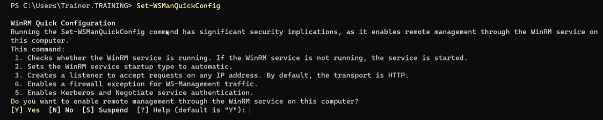

# PowerShell Remoting



PSRemoting Handles:

- Connection management (one ore more remote machines)
  - Run command in parallel on multiple machines
- Authentication
- Command Execution
  - Single Commands or Script
- Returning output from remote machine

## PS Remoting Connections

- Primarily designed for working inside an Active Directory environment
  - Inherent trust as all machines are part of the same domain

Three different connection types:

- HTTP (default) - [WS-Man Connections](https://learn.microsoft.com/en-us/powershell/scripting/learn/remoting/wsman-remoting-in-powershell?view=powershell-7.4)
- HTTPS - Need to acquire, provision and manage certificates. Additional set up required
- SSH - Allows cross platform connections (incl. Windows and Linux)

### Enable PowerShell Remoting using WS-Man

```powershell
# Enable over HTTP
Set-WSManQuickConfig

# Enable over HTTPS
Set-WSManQuickConfig -UseSSL

# Enable Remoting - Configures local machine to accept PowerShell remoting commands
# PowerShell remoting is enabled by default on Windows Servers
# Not required on machines that only send commands
# Will enable an endpoint for each specific version of PowerShell installed
Enable-PSRemoting -Force

# Enable Remoting with no network profile check - Sometime remoting can be blocked if your network connection is defined as Public
Enable-PSRemoting -Force -SkipNetworkProfileCheck

```

What happens when you run Quick Configuration:



Service called Windows Remote Management (WS-Management) - Win RM is started

### Set up Remoting for Non-Administrators

As enabling remoting requires Admin rights, not everyone has this.

Could use local security groups

- Define Active Directory Security Group
- Add Group to the Remote Management Users Group locally

Can also enable via GPO

- GPO Policy Management
- Computer Configuration
- Windows Remote Management (WinRM) settings
- Set the Allow option for WinRM Service

### Enabling SSH PowerShell Remoting

Supported on both Windows and Linux

- Latest version of PowerShell (7 or greater)
- [Install latest version of OpenSSH](https://learn.microsoft.com/en-us/windows-server/administration/openssh/openssh_install_firstuse?tabs=gui)
- Define SSH Configuration
- Restart the SSH Service

Prepare Windows for SSH Remoting:

```powershell

# Install OpenSSH Client and Server
Add-WindowsCapability -Online -Name OpenSSH.Client
Add-WindowsCapability -Online -Name OpenSSH.Server

# Set the SSH Server Service to start Automatically
# Might need to restart the machine before you can do the following
Set-Service -Name sshd -StartupType "Automatic"
Start-Service -Name sshd

# Install and Import PowerShell remoting module
# Will require PS7 or greater
Install-Module -Name Microsoft.PowerShell.RemotingTools
Import-Module -Name Microsoft.PowerShell.RemotingTools

# Enable SSH Remoting and Restart the Service
Enable-SSHRemoting -Verbose
Restart-Service -Name sshd

```
